# Panduan Fitur Baru & Langkah Update di Server Production

Dokumen ini berisi dokumentasi perubahan fitur terbaru (3 Jenis Surat Prioritas, Role Bendahara, Fleksibilitas Nomor Surat, dan Template PDF) serta panduan langkah demi langkah untuk melakukan deploy/update di server **production** secara aman tanpa merusak data yang sudah ada.

---

## DAFTAR ISI
1. [Ringkasan Perubahan Sistem](#1-ringkasan-perubahan-sistem)
2. [Langkah Update di Server Production](#2-langkah-update-di-server-production)
   - [Opsi A: Menggunakan Artisan Seeder (Direkomendasikan & Aman)](#opsi-a-menggunakan-artisan-seeder-direkomendasikan--aman)
   - [Opsi B: Menggunakan Laravel Tinker (Manual & Presisi)](#opsi-b-menggunakan-laravel-tinker-manual--presisi)
   - [Opsi C: Menggunakan SQL Query Langsung](#opsi-c-menggunakan-sql-query-langsung)
3. [Alur & Cara Penggunaan Fitur Baru](#3-alur--cara-penggunaan-fitur-baru)
4. [Daftar Akun & Kredensial Pengujian](#4-daftar-akun--kredensial-pengujian)

---

## 1. Ringkasan Perubahan Sistem

### A. Nomor Surat Bersifat Fleksibel / Opsional
- Permintaan: Nomor surat untuk Surat Tugas dan ketiga surat baru dapat dikosongkan jika penomoran dilakukan manual/fisik oleh TU setelah dicetak.
- Perubahan:
  - Validasi `noSurat` dibuat `nullable` di `app/Http/Controllers/StaffDekanController.php`.
  - Pada template cetak dokumen PDF, jika `noSurat` kosong atau tidak diisi, sistem otomatis menampilkan titik-titik (`..........`) yang siap dicap/diketik manual.
  - Verifikasi tanda tangan digital via QR code tetap bekerja 100% valid karena verifikasi URL menggunakan UUID surat (`previewSuratQR`), bukan nomor surat teks.

### B. Role Baru: Bendahara (Role ID 22)
- Dibuat untuk tahap akhir pencairan dana setelah disetujui Kabag.
- Memiliki dashboard tersendiri di `/bendahara`.
- Fitur:
  - Melihat Surat Masuk ajuan pencairan dana dari staf maupun mahasiswa/ormawa.
  - Memeriksa rincian tabel anggaran, total biaya, rekening tujuan transfer, dan dokumen proposal/RAB.
  - Opsi input Nomor Bukti Pencairan / KAS dan Catatan Bendahara.
  - Menyetujui surat (mengubah status menjadi `selesai`) atau menolak surat.
  - Riwayat persetujuan dan profil bendahara.

### C. 3 Jenis Surat Prioritas Baru
1. **Surat Permohonan Narasumber** (`surat-permohonan-narasumber`):
   - Pengaju: Staf / Dosen.
   - Alur: Staf $\rightarrow$ Kaprodi $\rightarrow$ Dekan $\rightarrow$ Staff Dekan (`selesai`).
2. **Surat Peminjaman Ruang**:
   - Versi Staf (`surat-peminjaman-ruang`): Staf $\rightarrow$ Kaprodi $\rightarrow$ WD2 $\rightarrow$ TU (`selesai`).
   - Versi Mahasiswa/Ormawa (`surat-peminjaman-ruang-mahasiswa`): Mahasiswa $\rightarrow$ Kaprodi $\rightarrow$ WD3 $\rightarrow$ WD2 $\rightarrow$ TU (`selesai`). Dilengkapi field `nama_organisasi` dan `jabatan_pengaju`.
3. **Surat Usulan Pencairan Dana**:
   - Versi Staf (`surat-pencairan-dana`): Staf $\rightarrow$ Kaprodi $\rightarrow$ WD2 $\rightarrow$ Kabag $\rightarrow$ Bendahara (`selesai`).
   - Versi Mahasiswa/Ormawa (`surat-pencairan-dana-mahasiswa`): Mahasiswa $\rightarrow$ Kaprodi $\rightarrow$ WD3 $\rightarrow$ WD2 $\rightarrow$ Kabag $\rightarrow$ Bendahara (`selesai`). Dilengkapi form rincian anggaran dinamis (Alpine.js) + hitung total otomatis, data rekening bank, serta upload proposal.

### D. Template Cetak PDF & Preview
- Terletak di `resources/views/template/`:
  - `surat-permohonan-narasumber.blade.php`
  - `surat-peminjaman-ruang.blade.php`
  - `surat-ajuan-dana.blade.php`
- Disesuaikan dengan format resmi FKIP Universitas Bengkulu (Kop Kemendiktisaintek, tata letak, dan QR Code verifikasi).

---

## 2. Langkah Update di Server Production

> [!IMPORTANT]
> **JANGAN PERNAH** menjalankan `php artisan migrate:fresh` atau `php artisan migrate:refresh` di server production, karena perintah tersebut akan menghapus seluruh data surat dan pengguna yang sudah ada!

Ikuti salah satu opsi aman di bawah ini untuk mengupdate server production.

---

### Opsi A: Menggunakan Artisan Seeder (Direkomendasikan & Aman)

Seluruh seeder yang kita perbarui (`RoleSeeder`, `JenisSuratSeeder`, dan `UserSeeder`) menggunakan metode `firstOrCreate`. Artinya:
- **TIDAK AKAN** mengubah data pengguna yang sudah ada.
- **TIDAK AKAN** mengubah password atau email pengguna lama.
- **HANYA** menambahkan role baru, jenis surat baru, dan user bendahara jika belum ada di database.

#### Langkah-langkah:
1. Masuk ke server production dan arahkan ke direktori proyek:
   ```bash
   cd /path/to/si-surat-fkip
   ```

2. Tarik kode terbaru dari repositori Git:
   ```bash
   git pull origin main
   ```

3. Jalankan pembaruan dependensi jika diperlukan:
   ```bash
   composer install --no-dev --optimize-autoloader
   ```

4. Jalankan seeder spesifik satu per satu:
   ```bash
   php artisan db:seed --class=RoleSeeder
   php artisan db:seed --class=JenisSuratSeeder
   php artisan db:seed --class=UserSeeder
   ```

5. Bersihkan cache aplikasi agar route dan view baru terdeteksi:
   ```bash
   php artisan route:clear
   php artisan config:clear
   php artisan view:clear
   php artisan optimize
   ```

---

### Opsi B: Menggunakan Laravel Tinker (Manual & Presisi)

Jika Anda tidak ingin menjalankan class seeder sama sekali dan hanya ingin menyisipkan data baru secara presisi, gunakan perintah `php artisan tinker`:

1. Buka shell tinker:
   ```bash
   php artisan tinker
   ```

2. Jalankan baris PHP berikut di dalam tinker:
   ```php
   // 1. Tambah Role Bendahara (ID 22)
   App\Models\Role::firstOrCreate(
       ['name' => 'bendahara'],
       ['description' => 'Bendahara']
   );

   // 2. Tambah 3 Jenis Surat Baru
   $jenis = [
       ['name' => 'Surat Permohonan Narasumber', 'slug' => 'surat-permohonan-narasumber', 'user_type' => 'staff'],
       ['name' => 'Surat Peminjaman Ruang', 'slug' => 'surat-peminjaman-ruang', 'user_type' => 'staff'],
       ['name' => 'Surat Peminjaman Ruang Mahasiswa', 'slug' => 'surat-peminjaman-ruang-mahasiswa', 'user_type' => 'mahasiswa'],
       ['name' => 'Surat Usulan Pengajuan Dana', 'slug' => 'surat-pencairan-dana', 'user_type' => 'staff'],
       ['name' => 'Surat Pencairan Dana Kegiatan Mahasiswa', 'slug' => 'surat-pencairan-dana-mahasiswa', 'user_type' => 'mahasiswa'],
   ];
   foreach ($jenis as $item) {
       App\Models\JenisSurat::firstOrCreate(['slug' => $item['slug']], $item);
   }

   // 3. Tambah Akun Default Bendahara
   $roleBendahara = App\Models\Role::where('name', 'bendahara')->first();
   App\Models\User::firstOrCreate(
       ['username' => 'bendahara'],
       [
           'name' => 'Bendahara Fakultas',
           'email' => 'bendaharafkip@unib.ac.id',
           'password' => bcrypt('password'), // Ganti dengan password kuat untuk production
           'role_id' => $roleBendahara->id ?? 22,
           'email_verified_at' => now(),
       ]
   );

   exit;
   ```

3. Bersihkan cache:
   ```bash
   php artisan optimize:clear
   php artisan optimize
   ```

---

### Opsi C: Menggunakan SQL Query Langsung

Jika lebih nyaman mengeksekusi langsung via PhpMyAdmin / MySQL CLI / DBeaver:

```sql
-- 1. Insert Role Bendahara jika belum ada
INSERT INTO roles (name, description, created_at, updated_at)
SELECT 'bendahara', 'Bendahara', NOW(), NOW()
WHERE NOT EXISTS (SELECT 1 FROM roles WHERE name = 'bendahara');

-- 2. Dapatkan ID role bendahara (biasanya 22)
SET @role_bendahara_id = (SELECT id FROM roles WHERE name = 'bendahara' LIMIT 1);

-- 3. Insert Jenis Surat Baru jika belum ada
INSERT INTO jenis_surat_tables (name, slug, user_type, created_at, updated_at)
SELECT 'Surat Permohonan Narasumber', 'surat-permohonan-narasumber', 'staff', NOW(), NOW()
WHERE NOT EXISTS (SELECT 1 FROM jenis_surat_tables WHERE slug = 'surat-permohonan-narasumber');

INSERT INTO jenis_surat_tables (name, slug, user_type, created_at, updated_at)
SELECT 'Surat Peminjaman Ruang', 'surat-peminjaman-ruang', 'staff', NOW(), NOW()
WHERE NOT EXISTS (SELECT 1 FROM jenis_surat_tables WHERE slug = 'surat-peminjaman-ruang');

INSERT INTO jenis_surat_tables (name, slug, user_type, created_at, updated_at)
SELECT 'Surat Peminjaman Ruang Mahasiswa', 'surat-peminjaman-ruang-mahasiswa', 'mahasiswa', NOW(), NOW()
WHERE NOT EXISTS (SELECT 1 FROM jenis_surat_tables WHERE slug = 'surat-peminjaman-ruang-mahasiswa');

INSERT INTO jenis_surat_tables (name, slug, user_type, created_at, updated_at)
SELECT 'Surat Usulan Pengajuan Dana', 'surat-pencairan-dana', 'staff', NOW(), NOW()
WHERE NOT EXISTS (SELECT 1 FROM jenis_surat_tables WHERE slug = 'surat-pencairan-dana');

INSERT INTO jenis_surat_tables (name, slug, user_type, created_at, updated_at)
SELECT 'Surat Pencairan Dana Kegiatan Mahasiswa', 'surat-pencairan-dana-mahasiswa', 'mahasiswa', NOW(), NOW()
WHERE NOT EXISTS (SELECT 1 FROM jenis_surat_tables WHERE slug = 'surat-pencairan-dana-mahasiswa');

-- 4. Insert User Bendahara (UUID dibuat menggunakan UUID())
INSERT INTO users (id, username, name, email, password, role_id, email_verified_at, created_at, updated_at)
SELECT UUID(), 'bendahara', 'Bendahara Fakultas', 'bendaharafkip@unib.ac.id', '$2y$10$92IXUNpkjO0rOQ5byMi.Ye4oKoEa3Ro9llC/.og/at2.uheWG/igi', @role_bendahara_id, NOW(), NOW(), NOW()
WHERE NOT EXISTS (SELECT 1 FROM users WHERE username = 'bendahara');
```

---

## 3. Alur & Cara Penggunaan Fitur Baru

```mermaid
graph TD
    subgraph Alur_Dana_Mahasiswa
        M1[Mahasiswa / Ormawa] -->|Ajukan Surat Dana| K1[Koordinator Prodi]
        K1 -->|Setujui| W3[WD 3 Kemahasiswaan]
        W3 -->|Setujui| W2[WD 2 Keuangan & Umum]
        W2 -->|Setujui| KB1[Kabag TU]
        KB1 -->|Teruskan ke Bendahara| BD1[Bendahara]
        BD1 -->|Setujui & Selesaikan| S1[SELESAI / Dana Dicairkan]
    end

    subgraph Alur_Ruang_Mahasiswa
        M2[Mahasiswa / Ormawa] -->|Ajukan Pinjam Ruang| K2[Koordinator Prodi]
        K2 -->|Setujui| W3B[WD 3 Kemahasiswaan]
        W3B -->|Setujui| W2B[WD 2 Keuangan & Umum]
        W2B -->|Teruskan ke TU| TU1[Tata Usaha]
        TU1 -->|Setujui & Selesaikan| S2[SELESAI / Ruangan Disetujui]
    end

    subgraph Alur_Narasumber_Staf
        ST1[Staf / Dosen] -->|Ajukan Permohonan Narasumber| K3[Koordinator Prodi]
        K3 -->|Setujui| DK1[Dekan]
        DK1 -->|Setujui| SD1[Staff Dekan]
        SD1 -->|Terbitkan Nomor / Selesaikan| S3[SELESAI / Cetak Surat]
    end
```



---

## 4. Daftar Akun & Kredensial Pengujian

| Peran (Role) | Username | Password Default | Halaman Utama |
|---|---|---|---|
| **Mahasiswa** | `mahasiswa_kimia` atau `mahasiswa_fisika` | `password` | `/mahasiswa/dashboard` |
| **Staf** | `staff_kimia` atau `staff_fisika` | `password` | `/staff/surat-masuk` |
| **Kaprodi** | `kaprodi_kimia` | `password` | `/kaprodi/surat-masuk` |
| **WD 3 (Kemahasiswaan)** | `wd3` | `password` | `/wd3/surat-masuk` |
| **WD 2 (Keuangan & Umum)** | `wd2` | `password` | `/wd2/surat-masuk` |
| **Kabag** | `kabag` | `password` | `/kabag/surat-masuk` |
| **Bendahara** | `bendahara` | `password` | `/bendahara/surat-masuk` |
| **Tata Usaha (TU)** | `tata_usaha` | `password` | `/tata-usaha/surat-masuk` |
| **Dekan** | `dekan` | `password` | `/dekan/surat-masuk` |
| **Staff Dekan** | `staff_dekan` | `password` | `/staff-dekan/surat-masuk` |
