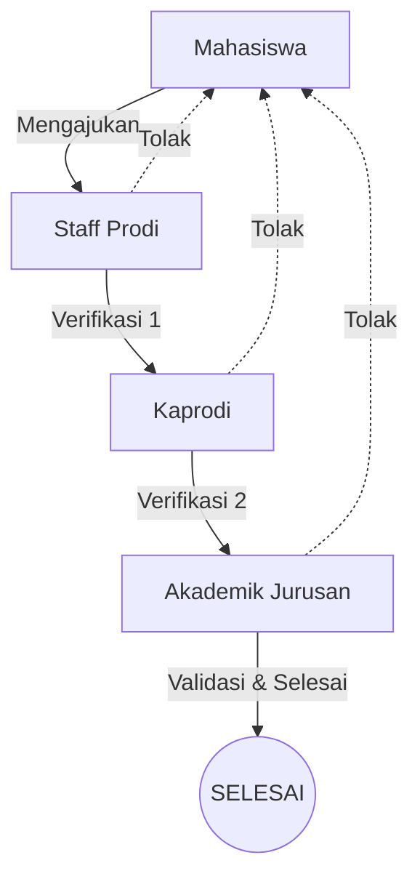
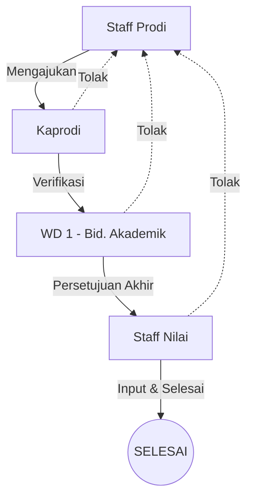
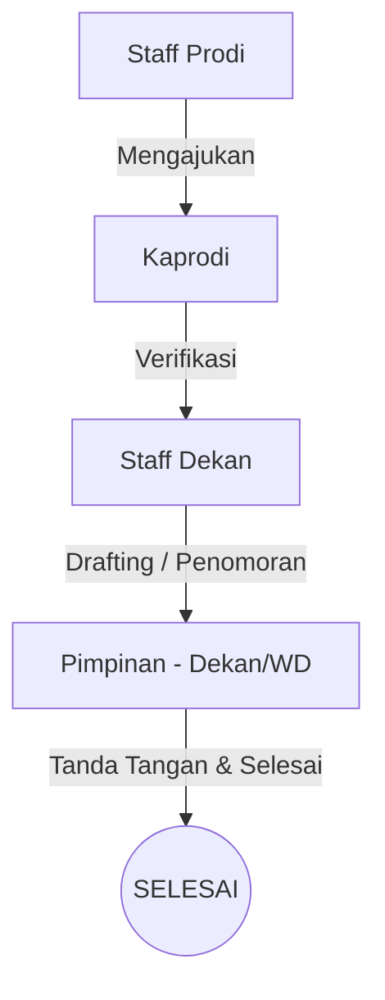
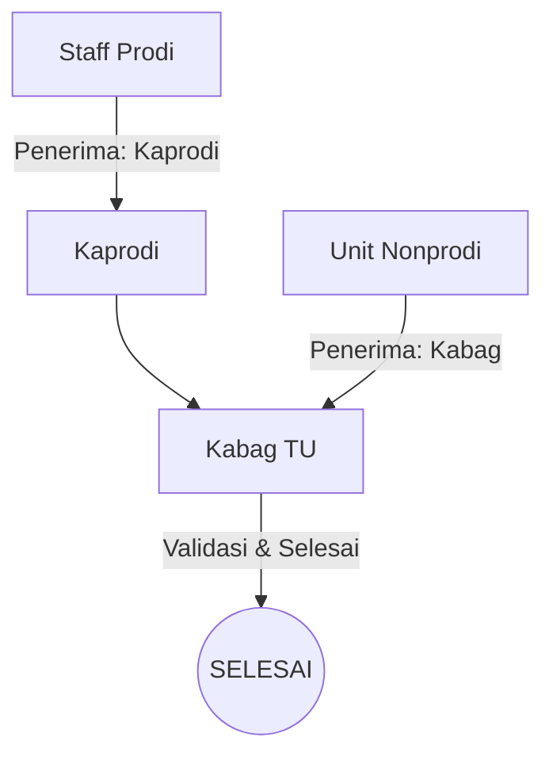
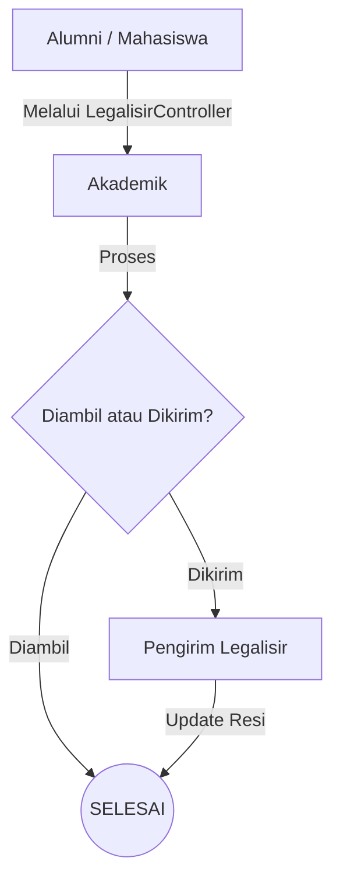
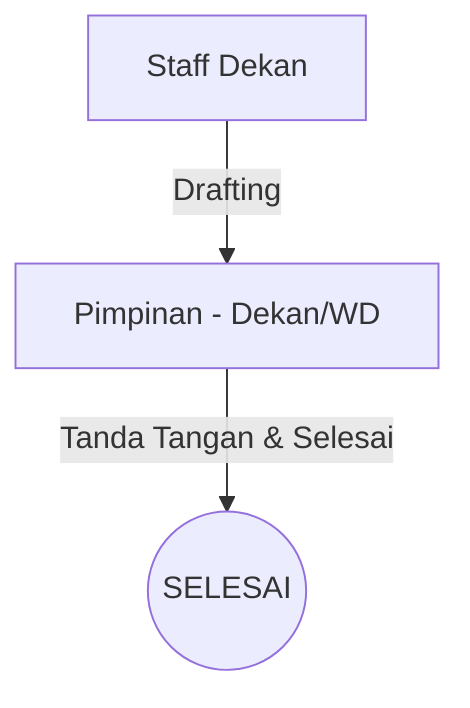

# Dokumentasi Alur Kerja (Workflow) Surat

Dokumen ini menjelaskan alur kerja pengajuan surat di sistem **si-surat-fkip**. Setiap jenis surat memiliki urutan verifikasi yang berbeda-beda tergantung pada pengaju dan tujuan surat tersebut.

---

## 1. Alur Surat Mahasiswa (Akademik)
Digunakan untuk surat seperti: *Aktif Kuliah, Surat Keterangan Lulus (SKL), Eligible PIN, Rekomendasi MBKM, dll.*

**Detail Langkah:**
1. **Mahasiswa**: Memulai pengajuan dan memilih Staff Prodi di prodi masing-masing.
2. **Staff Prodi (Role 3)**: Melakukan pengecekan berkas awal.
3. **Kaprodi (Role 4)**: Memberikan persetujuan tingkat program studi.
4. **Akademik (Role 6)**: Melakukan validasi akhir, memberikan nomor surat, dan menutup alur (`Selesai`).

---

## 2. Alur Berita Acara Nilai (BAN)
Digunakan oleh Staff Prodi untuk pengajuan berita acara perubahan atau input nilai.

**Detail Langkah:**
1. **Staff (Role 3)**: Mengajukan BAN ke Kaprodi.
2. **Kaprodi (Role 4)**: Menelaah urgensi perubahan nilai.
3. **WD 1 (Role 5)**: Memberikan lampu hijau secara fakultas.
4. **Staff Nilai (Role 7)**: Melakukan eksekusi input nilai ke sistem akademik dan menandai surat `Selesai`.

---

## 3. Alur Surat Tugas (Staff Prodi)
Digunakan untuk penugasan dosen atau staff baik individu maupun kelompok.

**Detail Langkah:**
1. **Staff (Role 3)**: Mengajukan surat tugas ke Kaprodi.
2. **Kaprodi (Role 4)**: Menyetujui penugasan.
3. **Staff Dekan (Role 14)**: Memproses administrasi dan meneruskan ke pimpinan yang relevan.
4. **Pimpinan (Role 5/8/9/10)**: Menandatangani secara digital dan surat dinyatakan `Selesai`.

---

## 4. Alur Pengajuan ATK (Alat Tulis Kantor)
Alur ini lebih singkat dan bermuara pada bagian logistik/umum.

**Detail Jalur:**
* **Jalur Prodi**: Staff -> Kaprodi -> Kabag.
* **Jalur Unit (TU/Akademik/dll)**: Pengaju -> Kabag secara langsung.
* **Tujuan Akhir**: **Kabag (Role 17)** memverifikasi ketersediaan stok dan menyelesaikan pengajuan.

---

## 5. Alur Legalisir Ijazah
Alur khusus untuk alumni/mahasiswa yang membutuhkan validasi dokumen fisik/digital.

**Detail Langkah:**
1. **Pengaju**: Melakukan permohonan legalisir.
2. **Akademik (Role 6)**: Menyiapkan dokumen legalisir.
3. **Pilihan**:
    * Jika **Ambil sendiri**, Akademik langsung menutup alur.
    * Jika **Dikirim**, diteruskan ke **Pengirim Legalisir (Role 15)** untuk proses kurir.

---

## 6. Alur Surat Dekanat (Surat Keluar)
Surat yang dibuat oleh internal dekanat untuk pihak luar atau penugasan internal.

**Detail Langkah:**
1. **Staff Dekan (Role 14)**: Membuat draf surat keluar.
2. **Pimpinan (Role 5, 8, 9, atau 10)**: Melakukan review dan tanda tangan final.

---

## Ringkasan Peran Utama (Role ID)

Berikut adalah daftar lengkap ID Role yang digunakan dalam sistem, dikelompokkan berdasarkan fungsinya:

### 1. Pimpinan (Otoritas Tanda Tangan)
*   **Role 8**: Dekan
*   **Role 5**: Wakil Dekan 1 (Bidang Akademik)
*   **Role 9**: Wakil Dekan 2 (Bidang Umum & Keuangan)
*   **Role 10**: Wakil Dekan 3 (Bidang Kemahasiswaan & Alumni)

### 2. Struktur Program Studi
*   **Role 3**: Staff Prodi (Verifikator Awal / Pengaju Internal)
*   **Role 4**: Kaprodi (Verifikator tingkat Program Studi)

### 3. Layanan Akademik & Fakultas
*   **Role 6**: Akademik (Verifikator tingkat Fakultas / Tujuan Akhir Mhs)
*   **Role 16**: Akademik Fakultas (Unit Verifikasi Tambahan)
*   **Role 7**: Staff Nilai (Eksekutor input nilai pada alur BAN)
*   **Role 15**: Pengirim Legalisir (Proses logistik pengiriman ijazah)

### 4. Administrasi Umum & Unit Kerja
*   **Role 17**: Kabag (Kepala Bagian - Verifikator Akhir Keuangan/ATK)
*   **Role 19**: Tata Usaha (Unit Kerja Nonprodi)
*   **Role 20**: Unit Kerjasama (Unit Kerja Nonprodi)
*   **Role 21**: Lab PMIPA (Unit Laboratorium)
*   **Role 18**: Kemahasiswaan (Unit Kerja Nonprodi)

### 5. Staff Pendukung (Staf Administrasi Pimpinan)
*   **Role 14**: Staff Dekan (Drafting Surat Keluar / Surat Tugas)
*   **Role 11**: Staff Wakil Dekan 1
*   **Role 12**: Staff Wakil Dekan 2
*   **Role 13**: Staff Wakil Dekan 3

### 6. Sistem & Pengguna Umum
*   **Role 1**: Admin (Akses Developer / Manajemen Database)
*   **Role 2**: Mahasiswa (Pengaju utama berbagai jenis surat akademik)

