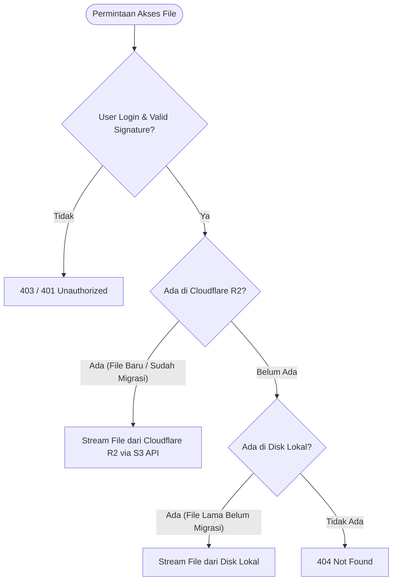

# Panduan & Dokumentasi Migrasi Storage ke Cloudflare R2

Dokumen ini menjelaskan arsitektur penyimpanan cloud, konfigurasi, dan panduan lengkap penggunaan perintah artisan `storage:migrate-to-r2` untuk memigrasikan berkas (lampiran, tanda tangan, stempel) dari disk lokal hosting ke **Cloudflare R2 (S3-Compatible Object Storage)**.

---

## 1. Arsitektur & Cara Kerja Storage

Aplikasi menggunakan service [`App\Services\StorageHelper`](../app/Services/StorageHelper.php) sebagai jembatan penyimpanan dengan sistem **Dual-Fallback** (*Zero Downtime & Zero 404*):



### Keunggulan Arsitektur:
1. **100% Private (Tanpa Public URL):** File di R2 tidak dibuka untuk publik. Setiap berkas diakses melalui backend Laravel menggunakan Signed URL terenkripsi dan pengecekan otentikasi akun.
2. **Auto Fallback:** Berkas lama yang belum dimigrasi tetap dapat dibuka normal dari server lokal tanpa ada link rusak (*broken link*).
3. **Upload Baru Langsung ke Cloud:** Setelah `FILESYSTEM_DISK=r2`, seluruh berkas baru yang diunggah otomatis tersimpan di R2 sehingga disk hosting tidak bertambah penuh.

---

## 2. Konfigurasi Environment (`.env`)

Tambahkan variabel berikut pada file `.env`:

```env
# Aktifkan driver R2 sebagai disk utama
FILESYSTEM_DISK=r2

# Kredensial Cloudflare R2
CLOUDFLARE_R2_ACCESS_KEY_ID=isi_dengan_access_key_id
CLOUDFLARE_R2_SECRET_ACCESS_KEY=isi_dengan_secret_access_key
CLOUDFLARE_R2_BUCKET=si-surat-fkip
CLOUDFLARE_R2_ENDPOINT=https://<ACCOUNT_ID>.r2.cloudflarestorage.com
CLOUDFLARE_R2_URL=
CLOUDFLARE_R2_USE_PATH_STYLE_ENDPOINT=false
```

> **Catatan:** `CLOUDFLARE_R2_URL` sengaja dikosongkan karena bucket bersifat *Private* dan disajikan melalui stream backend.

---

## 3. Dokumentasi Command Artisan: `storage:migrate-to-r2`

Perintah ini dirancang untuk menyalin berkas dari disk lokal (`storage/app/public/` dan `storage/app/`) ke bucket Cloudflare R2.

### Signature Command
```bash
php artisan storage:migrate-to-r2 [options]
```

### Daftar Opsi / Parameter:

| Parameter | Deskripsi | Contoh Penggunaan |
|---|---|---|
| `--dry-run` | Menjalankan simulasi tanpa mengunggah atau menghapus berkas apapun. | `php artisan storage:migrate-to-r2 --dry-run` |
| `--limit=N` | Membatasi jumlah berkas maksimum yang dimigrasikan dalam satu kali eksekusi. | `php artisan storage:migrate-to-r2 --limit=50` |
| `--max-mb=N` | Menghentikan migrasi secara otomatis saat akumulasi ukuran mencapai batas MB tertentu. | `php artisan storage:migrate-to-r2 --max-mb=1000` |
| `--delete-local` | Menghapus berkas lokal **hanya setelah** berkas terverifikasi 100% sukses dan utuh di R2. | `php artisan storage:migrate-to-r2 --delete-local` |
| `--directory=DIR` | Memilih direktori tertentu untuk dimigrasi (`lampiran`, `ttd`, atau `stempel`). | `php artisan storage:migrate-to-r2 --directory=lampiran` |

---

## 4. Skenario Penggunaan Praktis

### Skenario A: Simulasi Pengecekan Berkas (Dry Run)
Gunakan sebelum migrasi untuk melihat berapa banyak berkas yang terdeteksi dan total ukurannya:
```bash
php artisan storage:migrate-to-r2 --dry-run
```

### Skenario B: Migrasi Parsial / Bertahap (Menjaga Kuota Free Tier)
Misalnya ingin memigrasikan **1 GB (1.000 MB)** berkas terlama terlebih dahulu:
```bash
php artisan storage:migrate-to-r2 --max-mb=1000 --delete-local
```

### Skenario C: Migrasi Per Batch Jumlah File
Misalnya ingin memigrasikan **50 berkas** per sesi:
```bash
php artisan storage:migrate-to-r2 --limit=50 --delete-local
```

### Skenario D: Migrasi Penuh (Seluruh Berkas)
Untuk memindahkan semua sisa berkas lokal sekaligus ke R2:
```bash
php artisan storage:migrate-to-r2 --delete-local
```

---

## 5. Fitur Keamanan & Integritas Data

1. **Anti-Duplikasi:**
   Sebelum mengunggah, skrip selalu memeriksa keberadaan berkas di R2 (`Storage::disk('r2')->exists($file)`). Berkas yang sudah ada di R2 akan otomatis dilewati (*skipped*).
2. **Urutan Kronologis (*Oldest First*):**
   Berkas diurutkan berdasarkan waktu pembuatan/modifikasi (`filemtime`). Berkas lampiran surat yang paling lama akan dimigrasikan lebih dulu.
3. **Double Integrity Check Sebelum Hapus Lokal:**
   Ketika opsi `--delete-local` aktif, berkas di server lokal **hanya akan dihapus** jika memenuhi 2 syarat:
   - Berkas terdeteksi sudah ada di R2.
   - Ukuran byte di R2 sama persis dengan ukuran byte berkas lokal.
   *(Jika terjadi kegagalan jaringan atau ukuran tidak cocok, berkas lokal dipertahankan demi keamanan data).*

---

## 6. Verifikasi Pasca Migrasi

Setelah menjalankan migrasi:
1. **Cek Dashboard Cloudflare:** Buka menu **R2** > Pilih bucket > Periksa folder `lampiran/`, `ttd/`, dan `stempel/`.
2. **Uji di Web Aplikasi:** Buka salah satu surat lama dan surat baru di web, lalu klik tombol **"Lihat"** pada lampiran. File harus terbuka dan dapat dipreview langsung di browser.
3. **Cek Pengurangan Disk Hosting:** Jalankan perintah `df -h` atau `du -sh storage/app/public/` di terminal server untuk melihat kapasitas disk yang telah dibebaskan.
