# Panduan Fitur Baru & Langkah Update di Server Production

Dokumen ini berisi dokumentasi perubahan fitur terbaru (3 Jenis Surat Prioritas, Role Bendahara, Fleksibilitas Nomor Surat, dan Template PDF) serta panduan langkah demi langkah untuk melakukan deploy/update di server **production** secara aman tanpa merusak data yang sudah ada.

---

## DAFTAR ISI
1. [Ringkasan Perubahan Sistem](#1-ringkasan-perubahan-sistem)
2. [Langkah Update di Server Production](#2-langkah-update-di-server-production)
   - [Opsi A: Menggunakan Artisan Seeder (Direkomendasikan & Aman)](#opsi-a-menggunakan-artisan-seeder-direkomendasikan--aman)
   - [Opsi B: Menggunakan Laravel Tinker (Manual & Presisi)](#opsi-b-menggunakan-laravel-tinker-manual--presisi)
   - [Opsi C: Menggunakan SQL Query Langsung](#opsi-c-menggunakan-sql-query-langsung)
3. [Alur & Cara Penggunaan Fitur Baru](#3-alur--cara-penggunaan-fitur-baru)
4. [Daftar Akun & Kredensial Pengujian](#4-daftar-akun--kredensial-pengujian)
5. [Menjalankan Automated Tests (Verifikasi Otomatis)](#5-menjalankan-automated-tests-verifikasi-otomatis)

---

## 1. Ringkasan Perubahan Sistem

### A. Nomor Surat Bersifat Fleksibel / Opsional
- Permintaan: Nomor surat untuk Surat Tugas dan ketiga surat baru dapat dikosongkan jika penomoran dilakukan manual/fisik oleh TU setelah dicetak.
- Perubahan:
  - Validasi `noSurat` dibuat `nullable` di `app/Http/Controllers/StaffDekanController.php`.
  - Pada template cetak dokumen PDF, jika `noSurat` kosong atau tidak diisi, sistem otomatis menampilkan titik-titik (`..........`) yang siap dicap/diketik manual.
  - Verifikasi tanda tangan digital via QR code tetap bekerja 100% valid karena verifikasi URL menggunakan UUID surat (`previewSuratQR`), bukan nomor surat teks.

### B. Role Baru: Bendahara (Role ID 22)
- Dibuat untuk tahap akhir pencairan dana setelah disetujui Kabag.
- Memiliki dashboard tersendiri di `/bendahara`.
- Fitur:
  - Melihat Surat Masuk ajuan pencairan dana dari staf maupun mahasiswa/ormawa.
  - Memeriksa rincian tabel anggaran, total biaya, rekening tujuan transfer, dan dokumen proposal/RAB.
  - Opsi input Nomor Bukti Pencairan / KAS dan Catatan Bendahara.
  - Menyetujui surat (mengubah status menjadi `selesai`) atau menolak surat.
  - Riwayat persetujuan dan profil bendahara.

### C. 3 Jenis Surat Prioritas Baru
1. **Surat Permohonan Narasumber** (`surat-permohonan-narasumber`):
   - Pengaju: Staf / Dosen.
   - Alur: Staf $\rightarrow$ Kaprodi $\rightarrow$ Dekan $\rightarrow$ Staff Dekan (`selesai`).
2. **Surat Peminjaman Ruang**:
   - Versi Staf (`surat-peminjaman-ruang`): Staf $\rightarrow$ Kaprodi $\rightarrow$ WD2 $\rightarrow$ TU (`selesai`).
   - Versi Mahasiswa/Ormawa (`surat-peminjaman-ruang-mahasiswa`): Mahasiswa $\rightarrow$ Kaprodi $\rightarrow$ WD3 $\rightarrow$ WD2 $\rightarrow$ TU (`selesai`). Dilengkapi field `nama_organisasi` dan `jabatan_pengaju`.
3. **Surat Usulan Pencairan Dana**:
   - Versi Staf (`surat-pencairan-dana`): Staf $\rightarrow$ Kaprodi $\rightarrow$ WD2 $\rightarrow$ Kabag $\rightarrow$ Bendahara (`selesai`).
   - Versi Mahasiswa/Ormawa (`surat-pencairan-dana-mahasiswa`): Mahasiswa $\rightarrow$ Kaprodi $\rightarrow$ WD3 $\rightarrow$ WD2 $\rightarrow$ Kabag $\rightarrow$ Bendahara (`selesai`). Dilengkapi form rincian anggaran dinamis (Alpine.js) + hitung total otomatis, data rekening bank, serta upload proposal.

### D. Template Cetak PDF & Preview
- Terletak di `resources/views/template/`:
  - `surat-permohonan-narasumber.blade.php`
  - `surat-peminjaman-ruang.blade.php`
  - `surat-ajuan-dana.blade.php`
- Disesuaikan dengan format resmi FKIP Universitas Bengkulu (Kop Kemendiktisaintek, tata letak, dan QR Code verifikasi).

### E. Stepper Dinamis (Flexible Stepper) untuk Surat Alur Khusus / Ormawa
- **Latar Belakang Masalah**:
  - Pada surat standar akademik mahasiswa terdahulu, komponen stepper (`components/stepper.blade.php`) di-hardcode dengan 4 langkah tetap: Mahasiswa $\rightarrow$ Staff $\rightarrow$ Kaprodi $\rightarrow$ Akademik.
  - Saat surat ormawa/kegiatan mahasiswa baru (seperti surat usulan pencairan dana atau peminjaman ruang) diajukan dan diteruskan ke WD3, WD2, Kabag, atau Bendahara, stepper hardcoded tersebut gagal mengenali Role ID pejabat fakultas sehingga status visual stepper tampak "kereset" kembali ke tahap awal.
- **Solusi yang Diterapkan**:
  - **Delegasi Otomatis di Komponen Stepper**: `components/stepper.blade.php` kini mengecek `isset($surat->data['private']['stepper'])`. Jika ada array stepper dinamis, otomatis mengarahkan ke `components/stepper-flexible.blade.php`.
  - **Komponen `stepper-flexible`**: Menampilkan riwayat persetujuan secara dinamis berdasarkan urutan penandatangan/penyetuju yang sebenarnya (`App\Models\Role::find($role)->description`), menampilkan tanda centang hijau untuk pihak yang telah menyetujui, tanda "Menunggu" pada penerima saat ini (`$surat->current_user`), dan tanda silang merah "Ditolak" jika surat ditolak.
  - **Pencatatan Riwayat di Controller**: Seluruh controller pada alur (`KaprodiController`, `WD3Controller`, `WD2Controller`, `KabagController`, `BendaharaController`, `TataUsahaController`, `DekanController`, `StaffDekanController`) kini otomatis mencatat role ID pengguna saat ini ke array `$data['private']['stepper']` saat menyetujui atau menolak surat.
  - **Toleransi Data di Halaman Surat Masuk**: Menambahkan null-coalescing fallback pada NPM/Email pengaju di semua view `surat-masuk.blade.php` pejabat fakultas agar tidak pernah terjadi error `Undefined array key`.

---

## 2. Langkah Update di Server Production

> [!IMPORTANT]
> **JANGAN PERNAH** menjalankan `php artisan migrate:fresh` atau `php artisan migrate:refresh` di server production, karena perintah tersebut akan menghapus seluruh data surat dan pengguna yang sudah ada!

Ikuti salah satu opsi aman di bawah ini untuk mengupdate server production. **Opsi 1 (melalui Admin Filament)** sangat direkomendasikan jika Anda ingin menghindari eksekusi script seeder dan ingin password akun langsung dimasukkan secara rahasia tanpa terekspos dalam kode git.

---

### Opsi 1: Setup Manual Melalui Dashboard Admin Filament (Paling Direkomendasikan, Zero-Script, & Password Terlindungi)

Dengan tersedianya resource panel **Bendahara** di Filament Admin (`/admin`), Anda dapat menambahkan role, jenis surat, dan akun Bendahara murni menggunakan antarmuka grafis web (GUI).

> [!TIP]
> **Keunggulan Opsi Ini:**
> - **100% Zero-Script**: Tidak perlu menjalankan class seeder di terminal server yang berisiko ("ngeri-ngeri sedap" salah perintah).
> - **Password Aman & Rahasia**: Password diinput langsung saat pembuatan akun di browser, otomatis dienkripsi dengan algoritma hash aman Bcrypt bawaan Laravel, dan **sama sekali tidak pernah terekspos** sebagai teks mentah (plaintext) di file git seeder atau terminal history server.

#### Langkah-langkah:
1. **Tarik Kode Terbaru di Server Production**:
   ```bash
   cd /path/to/si-surat-fkip
   git pull origin main
   php artisan optimize:clear
   php artisan optimize
   ```

2. **Login ke Panel Admin**:
   - Buka browser dan akses: `https://domain-anda/admin/login`
   - Masuk menggunakan akun administrator.

3. **Tambah Role Bendahara (Jika Belum Ada)**:
   - Di bilah sidebar kiri, buka menu **Developer Tools** $\rightarrow$ **Role** (`/admin/roles`).
   - Periksa apakah role `bendahara` sudah ada. Jika belum:
     - Klik tombol **New Role** / **Buat Role**.
     - Isi **Name**: `bendahara`.
     - Isi **Description**: `Bendahara`.
     - Klik **Create** / **Simpan**.

4. **Tambah / Kelola Akun Bendahara (Langsung Isi Password Pribadi)**:
   - Di sidebar kiri, buka menu **Manajemen Akun** $\rightarrow$ **Bendahara** (`/admin/akun-bendahara`).
   - Klik tombol **New Bendahara** / **Buat Bendahara**.
   - Lengkapi formulir pendaftaran akun:
     - **Username**: `bendahara` (atau username khusus sesuai nama pejabat).
     - **Email**: `bendaharafkip@unib.ac.id` (atau email resmi kampus).
     - **Nama**: `Bendahara Fakultas` (atau nama lengkap beserta gelar).
     - **NIP**: Masukkan NIP dinas pejabat (opsional).
     - **Kata Sandi Baru**: Masukkan password kuat Anda secara langsung.
     - **Konfirmasi Kata Sandi Baru**: Masukkan ulang kata sandi yang sama.
   - Klik tombol **Create** / **Buat**.
   - *Hasil*: Akun bendahara langsung aktif, otomatis terhubung dengan `role_id = 22` (Role Bendahara), dan pejabat terkait langsung dapat login di halaman `/bendahara/surat-masuk`.

5. **Daftarkan Jenis Surat Baru (Jika Belum Ada)**:
   - Di menu **Developer Tools** $\rightarrow$ **Jenis Surat** (`/admin/jenis-surat`), klik **New Jenis Surat**:
     - *Surat Permohonan Narasumber*: Nama: `Surat Permohonan Narasumber`, Slug: `surat-permohonan-narasumber`, Tipe Pengguna: `Staff`.
     - *Surat Peminjaman Ruang*: Nama: `Surat Peminjaman Ruang`, Slug: `surat-peminjaman-ruang`, Tipe Pengguna: `Staff`.
     - *Surat Peminjaman Ruang Mahasiswa*: Nama: `Surat Peminjaman Ruang Mahasiswa`, Slug: `surat-peminjaman-ruang-mahasiswa`, Tipe Pengguna: `Mahasiswa`.
     - *Surat Usulan Pengajuan Dana*: Nama: `Surat Usulan Pengajuan Dana`, Slug: `surat-pencairan-dana`, Tipe Pengguna: `Staff`.
     - *Surat Pencairan Dana Kegiatan Mahasiswa*: Nama: `Surat Pencairan Dana Kegiatan Mahasiswa`, Slug: `surat-pencairan-dana-mahasiswa`, Tipe Pengguna: `Mahasiswa`.

---

### Opsi 2: Menggunakan Artisan Seeder (Otomatis & Idempoten)

Seluruh seeder yang kita perbarui (`RoleSeeder`, `JenisSuratSeeder`, dan `UserSeeder`) menggunakan metode `firstOrCreate`. Artinya:
- **TIDAK AKAN** mengubah data pengguna yang sudah ada.
- **TIDAK AKAN** mengubah password atau email pengguna lama.
- **HANYA** menambahkan role baru, jenis surat baru, dan user bendahara jika belum ada di database.

#### Langkah-langkah:
1. Masuk ke server production dan arahkan ke direktori proyek:
   ```bash
   cd /path/to/si-surat-fkip
   ```

2. Tarik kode terbaru dari repositori Git:
   ```bash
   git pull origin main
   ```

3. Jalankan pembaruan dependensi jika diperlukan:
   ```bash
   composer install --no-dev --optimize-autoloader
   ```

4. Jalankan seeder spesifik satu per satu:
   ```bash
   php artisan db:seed --class=RoleSeeder
   php artisan db:seed --class=JenisSuratSeeder
   php artisan db:seed --class=UserSeeder
   ```

5. Bersihkan cache aplikasi agar route dan view baru terdeteksi:
   ```bash
   php artisan route:clear
   php artisan config:clear
   php artisan view:clear
   php artisan optimize
   ```

---

### Opsi 3: Menggunakan Laravel Tinker (Manual & Presisi)

Jika Anda tidak ingin menjalankan class seeder sama sekali dan hanya ingin menyisipkan data baru secara presisi, gunakan perintah `php artisan tinker`:

1. Buka shell tinker:
   ```bash
   php artisan tinker
   ```

2. Jalankan baris PHP berikut di dalam tinker:
   ```php
   // 1. Tambah Role Bendahara (ID 22)
   App\Models\Role::firstOrCreate(
       ['name' => 'bendahara'],
       ['description' => 'Bendahara']
   );

   // 2. Tambah 3 Jenis Surat Baru
   $jenis = [
       ['name' => 'Surat Permohonan Narasumber', 'slug' => 'surat-permohonan-narasumber', 'user_type' => 'staff'],
       ['name' => 'Surat Peminjaman Ruang', 'slug' => 'surat-peminjaman-ruang', 'user_type' => 'staff'],
       ['name' => 'Surat Peminjaman Ruang Mahasiswa', 'slug' => 'surat-peminjaman-ruang-mahasiswa', 'user_type' => 'mahasiswa'],
       ['name' => 'Surat Usulan Pengajuan Dana', 'slug' => 'surat-pencairan-dana', 'user_type' => 'staff'],
       ['name' => 'Surat Pencairan Dana Kegiatan Mahasiswa', 'slug' => 'surat-pencairan-dana-mahasiswa', 'user_type' => 'mahasiswa'],
   ];
   foreach ($jenis as $item) {
       App\Models\JenisSurat::firstOrCreate(['slug' => $item['slug']], $item);
   }

   // 3. Tambah Akun Default Bendahara
   $roleBendahara = App\Models\Role::where('name', 'bendahara')->first();
   App\Models\User::firstOrCreate(
       ['username' => 'bendahara'],
       [
           'name' => 'Bendahara Fakultas',
           'email' => 'bendaharafkip@unib.ac.id',
           'password' => bcrypt('password'), // Ganti dengan password kuat untuk production
           'role_id' => $roleBendahara->id ?? 22,
           'email_verified_at' => now(),
       ]
   );

   exit;
   ```

3. Bersihkan cache:
   ```bash
   php artisan optimize:clear
   php artisan optimize
   ```

---

### Opsi 4: Menggunakan SQL Query Langsung

Jika lebih nyaman mengeksekusi langsung via PhpMyAdmin / MySQL CLI / DBeaver:

```sql
-- 1. Insert Role Bendahara jika belum ada
INSERT INTO roles (name, description, created_at, updated_at)
SELECT 'bendahara', 'Bendahara', NOW(), NOW()
WHERE NOT EXISTS (SELECT 1 FROM roles WHERE name = 'bendahara');

-- 2. Dapatkan ID role bendahara (biasanya 22)
SET @role_bendahara_id = (SELECT id FROM roles WHERE name = 'bendahara' LIMIT 1);

-- 3. Insert Jenis Surat Baru jika belum ada
INSERT INTO jenis_surat_tables (name, slug, user_type, created_at, updated_at)
SELECT 'Surat Permohonan Narasumber', 'surat-permohonan-narasumber', 'staff', NOW(), NOW()
WHERE NOT EXISTS (SELECT 1 FROM jenis_surat_tables WHERE slug = 'surat-permohonan-narasumber');

INSERT INTO jenis_surat_tables (name, slug, user_type, created_at, updated_at)
SELECT 'Surat Peminjaman Ruang', 'surat-peminjaman-ruang', 'staff', NOW(), NOW()
WHERE NOT EXISTS (SELECT 1 FROM jenis_surat_tables WHERE slug = 'surat-peminjaman-ruang');

INSERT INTO jenis_surat_tables (name, slug, user_type, created_at, updated_at)
SELECT 'Surat Peminjaman Ruang Mahasiswa', 'surat-peminjaman-ruang-mahasiswa', 'mahasiswa', NOW(), NOW()
WHERE NOT EXISTS (SELECT 1 FROM jenis_surat_tables WHERE slug = 'surat-peminjaman-ruang-mahasiswa');

INSERT INTO jenis_surat_tables (name, slug, user_type, created_at, updated_at)
SELECT 'Surat Usulan Pengajuan Dana', 'surat-pencairan-dana', 'staff', NOW(), NOW()
WHERE NOT EXISTS (SELECT 1 FROM jenis_surat_tables WHERE slug = 'surat-pencairan-dana');

INSERT INTO jenis_surat_tables (name, slug, user_type, created_at, updated_at)
SELECT 'Surat Pencairan Dana Kegiatan Mahasiswa', 'surat-pencairan-dana-mahasiswa', 'mahasiswa', NOW(), NOW()
WHERE NOT EXISTS (SELECT 1 FROM jenis_surat_tables WHERE slug = 'surat-pencairan-dana-mahasiswa');

-- 4. Insert User Bendahara (UUID dibuat menggunakan UUID())
INSERT INTO users (id, username, name, email, password, role_id, email_verified_at, created_at, updated_at)
SELECT UUID(), 'bendahara', 'Bendahara Fakultas', 'bendaharafkip@unib.ac.id', '$2y$10$92IXUNpkjO0rOQ5byMi.Ye4oKoEa3Ro9llC/.og/at2.uheWG/igi', @role_bendahara_id, NOW(), NOW(), NOW()
WHERE NOT EXISTS (SELECT 1 FROM users WHERE username = 'bendahara');
```

---

## 3. Alur & Cara Penggunaan Fitur Baru

```mermaid
graph TD
    subgraph Alur_Dana_Mahasiswa
        M1[Mahasiswa / Ormawa] -->|Ajukan Surat Dana| K1[Koordinator Prodi]
        K1 -->|Setujui| W3[WD 3 Kemahasiswaan]
        W3 -->|Setujui| W2[WD 2 Keuangan & Umum]
        W2 -->|Setujui| KB1[Kabag TU]
        KB1 -->|Teruskan ke Bendahara| BD1[Bendahara]
        BD1 -->|Setujui & Selesaikan| S1[SELESAI / Dana Dicairkan]
    end

    subgraph Alur_Ruang_Mahasiswa
        M2[Mahasiswa / Ormawa] -->|Ajukan Pinjam Ruang| K2[Koordinator Prodi]
        K2 -->|Setujui| W3B[WD 3 Kemahasiswaan]
        W3B -->|Setujui| W2B[WD 2 Keuangan & Umum]
        W2B -->|Teruskan ke TU| TU1[Tata Usaha]
        TU1 -->|Setujui & Selesaikan| S2[SELESAI / Ruangan Disetujui]
    end

    subgraph Alur_Narasumber_Staf
        ST1[Staf / Dosen] -->|Ajukan Permohonan Narasumber| K3[Koordinator Prodi]
        K3 -->|Setujui| DK1[Dekan]
        DK1 -->|Setujui| SD1[Staff Dekan]
        SD1 -->|Terbitkan Nomor / Selesaikan| S3[SELESAI / Cetak Surat]
    end
```



---

## 4. Daftar Akun & Kredensial Pengujian

| Peran (Role) | Username | Password Default | Halaman Utama |
|---|---|---|---|
| **Mahasiswa** | `mahasiswa_kimia` atau `mahasiswa_fisika` | `password` | `/mahasiswa/dashboard` |
| **Staf** | `staff_kimia` atau `staff_fisika` | `password` | `/staff/surat-masuk` |
| **Kaprodi** | `kaprodi_kimia` | `password` | `/kaprodi/surat-masuk` |
| **WD 3 (Kemahasiswaan)** | `wd3` | `password` | `/wd3/surat-masuk` |
| **WD 2 (Keuangan & Umum)** | `wd2` | `password` | `/wd2/surat-masuk` |
| **Kabag** | `kabag` | `password` | `/kabag/surat-masuk` |
| **Bendahara** | `bendahara` | `password` | `/bendahara/surat-masuk` |
| **Tata Usaha (TU)** | `tata_usaha` | `password` | `/tata-usaha/surat-masuk` |
| **Dekan** | `dekan` | `password` | `/dekan/surat-masuk` |
| **Staff Dekan** | `staff_dekan` | `password` | `/staff-dekan/surat-masuk` |

---

## 5. Menjalankan Automated Tests (Verifikasi Otomatis)

Anda tidak perlu lagi menguji alur surat secara manual dari akun ke akun. Cukup jalankan pengujian otomatis melalui terminal untuk memverifikasi seluruh alur dan template dalam hitungan detik.

### Perintah Menjalankan Seluruh Test:
```bash
./vendor/bin/sail artisan test
```

### File Test Suite yang Tersedia:
1. **Surat Pencairan Dana** (`tests/Feature/SuratPencairanDanaTest.php`):
   - Uji form pengajuan dana mahasiswa + upload file proposal.
   - Uji rantai persetujuan: Mahasiswa $\rightarrow$ Kaprodi $\rightarrow$ WD3 $\rightarrow$ WD2 $\rightarrow$ Kabag $\rightarrow$ Bendahara (`selesai`).
   - Uji penolakan surat oleh Bendahara beserta alasan penolakan.
2. **Surat Peminjaman Ruang** (`tests/Feature/SuratPeminjamanRuangTest.php`):
   - Uji alur peminjaman ruang mahasiswa ke TU.
   - Uji alur peminjaman ruang staf ke TU.
3. **Surat Permohonan Narasumber** (`tests/Feature/SuratPermohonanNarasumberTest.php`):
   - Uji pengajuan narasumber oleh staf.
   - Uji rantai persetujuan hingga Staff Dekan dengan nomor surat dikosongkan (opsional).
4. **Render Template PDF** (`tests/Feature/SuratPdfPreviewTest.php`):
   - Memastikan ketiga dokumen PDF (Narasumber, Ruang, Dana) berhasil dirender oleh DomPDF dengan status HTTP 200 tanpa error.
5. **Smoke Test Form Lama & Uji Regresi Surat Tugas** (`tests/Feature/LegacySuratRegressionTest.php`):
   - Smoke test memastikan 13 form surat mahasiswa lama terbuka dengan normal (HTTP 200).
   - Smoke test memastikan 7 form surat staf lama terbuka dengan normal (HTTP 200).
   - Regression test memastikan fitur pengosongan nomor surat tidak merusak alur persetujuan Surat Tugas lama (diuji baik nomor surat diisi maupun dikosongkan).

---

## 6. Catatan Perbaikan Bug & Keluhan Terbaru

| Keluhan / Isu | Penyebab Akar (Root Cause) | Solusi yang Diterapkan |
|---|---|---|
| **1. Submit Pencairan Dana Staff Gagal Nomor Rekening** | Mismatch nama atribut: form input menggunakan `name="no_rekening"`, namun controller memvalidasi `'nomor_rekening' => 'required'`. | Form input diubah ke `nomor_rekening` (`old('nomor_rekening')`), dan controller diperbarui agar mendukung `nomor_rekening` maupun fallback `no_rekening`. |
| **2. Tanda Titik Dua (:) Tidak Sejajar pada Template PDF Peminjaman Ruang** | Label dan isi diletakkan dalam satu kolom dengan titik dua menyatu di teks, sehingga baris berikutnya melipat tepat di bawah titik dua. | Template diperbarui menggunakan tabel 3 kolom terpisah (Kolom Label lebar tetap, Kolom `:`, Kolom Isi dengan `vertical-align: top`), sehingga baris berikutnya sejajar rapi di bawah teks tanpa melipat di bawah titik dua. |
| **3. Tombol Setujui Hilang / Hanya Ada Tombol Tolak di Bendahara & TU** | 1. Class styling tombol menggunakan `bg-emerald-600` dan `bg-green-600` yang tidak terkompilasi dalam build Tailwind production sehingga tombol berlatar transparan dengan teks putih (tidak terlihat di latar putih/abu-abu).<br>2. Filter slug di `WD2Controller.php` belum mencakup `surat-peminjaman-ruang-mahasiswa` dan `surat-pencairan-dana-mahasiswa`. | 1. Ditambahkan inline styles eksplisit (`style="background-color: #059669; color: #ffffff;"` dan `#16a34a`) serta class `bg-green-500` yang terbukti aktif di production, sehingga tombol Setujui tampil jelas dan mencolok.<br>2. Slug mahasiswa ditambahkan ke method approval `WD2Controller` agar surat diteruskan dengan benar ke TU dan Bendahara. |
| **4. Tempat Kegiatan Wajib Diisi pada Surat Permohonan Narasumber Staff** | Form `form-permohonan-narasumber.blade.php` tidak memiliki input untuk `tempat_kegiatan` (dan `jabatan_narasumber`), sementara controller mewajibkannya. | Input `tempat_kegiatan` dan `jabatan_narasumber` ditambahkan ke form blade, validasi jabatan dijadikan nullable, dan fallback otomatis disiapkan di controller. |
| **5. Fitur Preview & Cetak Surat pada Bendahara dan Tata Usaha** | Route dan tombol cetak/preview sebelumnya belum tersedia lengkap di Bendahara dan TU. Selain itu, tombol cetak dokumen tidak diperlukan pada tahap verifikasi (karena surat belum selesai/belum ber-QR Code). | 1. Ditambahkan route `print-surat-bendahara` di `routes/web.php`.<br>2. Pada tahap verifikasi (`diproses`), hanya tombol **Preview Dokumen** yang ditampilkan, didampingi ikon info `(i)` di sebelah kanannya yang menampilkan tooltip saat di-hover (*"Surat dianggap sah jika status surat adalah selesai dan sudah terdapat tanda tangan berupa QR Code"*). Tombol redundan "Cetak Dokumen" pada tahap ini ditiadakan.<br>3. Layout responsif diperbaiki sehingga tombol verifikasi otomatis melebar penuh (`w-full`) secara rapi dan proporsional pada tampilan mobile/layar kecil. |
| **6. Redundansi Tombol Preview & Cetak di Riwayat & Show Approval** | Terdapat tombol ganda Preview dan Cetak secara bersamaan pada riwayat persetujuan dan detail approval Bendahara dan TU. | Disederhanakan menjadi satu tombol saja secara kondisional: jika surat sudah `selesai` menampilkan tombol **Cetak**, jika belum selesai menampilkan tombol **Preview** (dengan tooltip penjelasan). |
| **7. TTD & NIP Wakil Dekan Kosong / Tidak Dinamis pada Template Surat** | 1. Pada `WD2Controller.php` method `setujuiSurat`, data approval tersimpan sebagai `namaWD1` dan `nipWD1` (sisa salinan WD1), sehingga `namaWD2` dan `nipWD2` kosong.<br>2. Template surat belum mengambil data secara dinamis dari relasi `approvals` yang tercatat saat pejabat terkait menyetujui surat. | 1. `WD2Controller.php` diperbarui agar menyimpan `namaWD2`, `nipWD2`, `namaWD`, `nipWD` secara lengkap beserta fallback `nip ?: username`.<br>2. Template PDF (`surat-ajuan-dana.blade.php` dan `surat-peminjaman-ruang.blade.php`) diperbarui untuk mengambil informasi nama dan NIP pejabat penandatangan secara dinamis langsung dari riwayat persetujuan (`$surat->approvals`) dan `data['private']`. |
| **8. Tampilan Profil Bendahara Tidak Seragam & Belum Ada Reset/Lupa Password** | Halaman profil bendahara belum mengikuti standar UI akun lain (seperti Tata Usaha), tidak memiliki mode edit form terpusat (`max-w-md mx-auto`), tombol ganti kata sandi, dan link lupa sandi. | 1. `bendahara/profile.blade.php` diperbarui mengikuti standar `tata-usaha/profile.blade.php` (email terverifikasi, nama lengkap, username, preview & upload TTD PNG transparan, tombol Edit kuning, tombol Atur Ulang Kata Sandi merah rose, tombol Batal pink, tombol Perbarui biru).<br>2. Ditambahkan view baru `resources/views/bendahara/reset-password.blade.php` lengkap dengan input kata sandi lama, baru, konfirmasi, dan tautan 'Lupa kata sandi?'.<br>3. Ditambahkan route `/bendahara/profile/reset-password` serta method `resetPasswordPage` dan `resetPassword` di `BendaharaController.php`. |
| **9. Tampilan Input File Jelek pada Form Surat Baru** | Tag `<input type="file">` diberi class padding manual (`p-2`) tanpa class styling native Flowbite standar dan tanpa pesan bantuan (help text). | Kelima form surat (`form-permohonan-narasumber`, `form-peminjaman-ruang`, `form-pencairan-dana`, `form-pencairan-dana-mahasiswa`, `form-peminjaman-ruang-mahasiswa`) diperbarui mengikuti template Flowbite standar seperti `form-keterangan-lulus.blade.php`, lengkap dengan teks format & batasan ukuran berkas (PDF maks 10MB / 5MB) dan dukungan dark mode. |
| **10. Stepper Tidak Muncul pada Surat yang Diajukan Staff** | View `staff/show-surat.blade.php` (dan `staff/show-approval.blade.php`) menggunakan pengecekan slug statis yang belum menyertakan ketiga surat baru (`surat-pencairan-dana`, `surat-peminjaman-ruang`, `surat-permohonan-narasumber`). | 1. Pada `staff/show-surat.blade.php`, stepper diubah agar memprioritaskan `<x-stepper-flexible :surat='$surat' />` jika data `private.stepper` tersedia.<br>2. Dilakukan sinkronisasi serupa ke semua view verifikasi & riwayat pejabat terkait (`show-approval.blade.php`, `kabag`, `wd2`, `wd3`, `dekan`, `kaprodi`, `bendahara`) agar stepper dinamis selalu tampil konsisten di setiap tahapan disposisi.<br>3. Ditambahkan pencatatan role ID ke stepper pada method persetujuan `KabagController.php`. |
| **11. Format & Penandatangan 3 Template Surat Tidak Sesuai Dokumen Asli** | Ketiga template surat baru (`surat-permohonan-narasumber`, `surat-peminjaman-ruang`, dan `surat-ajuan-dana`) sebelumnya banyak mengalami improvisasi/perubahan struktur yang tidak sesuai dengan dokumen asli di `docs-template/`, dan penandatangan surat salah dialokasikan ke Dekan / Wakil Dekan II padahal surat diajukan dari tingkat Program Studi dengan tujuan kepada Wakil Dekan II / Narasumber. | 1. **Penandatangan Dibenahi**: Penandatangan diubah menjadi **Koordinator Prodi / Koordinator Program Studi** dengan nama dan NIP diambil secara dinamis dari pejabat Kaprodi yang menyetujui (`$surat->approvals`), data persisted (`namaKaprodi`, `nipKaprodi`), atau master user Kaprodi prodi terkait.<br>2. **Surat Permohonan Narasumber**: Struktur dikembalikan persis ke template `PERMOHONAN MENJADI NARASUMBER.docx` (nomor surat `/UN30.7.10/DT.06/{tahun}`, kalimat pembuka *"Sehubungan akan dilaksanakannya Kegiatan [namaKegiatan] Program Studi [prodi] FKIP Universitas Bengkulu Tahun [tahun]..."*, rincian `Hari/Tanggal`, `Pukul`, `Acara`, `Tema/Materi`, `Tempat`, kalimat penutup *"Demikianlah surat ini kami sampaikan..."*, ttd Koordinator Prodi).<br>3. **Surat Peminjaman Ruang**: Struktur dikembalikan persis ke template `Surat Peminjaman Ruang.docx` (nomor surat `/UN30.7.11/PP/{tahun}`, perihal *"Permohonan Peminjaman [namaRuangan]"*, kalimat pembuka *"Sehubungan dengan akan dilaksanakannya kegiatan “[namaKegiatan]“ Program Studi [prodi] Jurusan [jurusan] (pamflet terlampir)..."*, tabel bersih hanya 2 baris `Hari/tanggal` & `Jam`, kalimat penutup *"Demikian atas perhatian dan kerjasama yang baik, disampaikan terima kasih."*, ttd Koordinator Program Studi).<br>4. **Surat Usulan Ajuan Dana**: Struktur dikembalikan persis ke template `SURAT AJUAN DANA 2026.xlsx` (nomor surat `/UN30.7.11/KU.01.02/{tahun}`, kalimat pembuka dengan Program Studi S1, Jurusan, dan Tahun Anggaran, tabel anggaran rapi dengan kolom `No | Kegiatan / Uraian Kebutuhan Anggaran | Jumlah Total (Rp)` dan footer `Jumlah Total`, tanpa menyertakan kolom/data bank di cetakan PDF resmi, penutup *"Atas perhatian dan kerjasama yang baik kami ucapkan terimakasih."*, ttd Koordinator Prodi).<br>5. **Sinkronisasi Controller**: `KaprodiController.php` method `setujuiSurat` dan `setujuiSuratStaff` diperbarui untuk menyimpan data approver `namaKaprodi`, `nipKaprodi`, dan `deskripsiKaprodi` ke `data['private']`, serta `WD2Controller.php` dijaga agar tidak menimpa penandatangan Kaprodi.<br>6. **Pembersihan Data Lama di Database**: Seluruh data surat lama di database yang sempat menyimpan identitas WD2 telah diperbarui langsung di database sehingga kini memuat nama & NIP Kaprodi yang menyetujui surat tersebut.<br>7. **Halaman Validasi QR Code**: `show-surat-qr.blade.php` dimutakhirkan agar menampilkan identitas penandatangan Koordinator Program Studi secara tepat dan mendukung jenis surat staf. |
| **12. Tombol Preview & Cetak Tidak Muncul pada Role Kabag** | 1. Pada `kabag/show-surat.blade.php`, tombol Preview sebelumnya dikomentari (`{{-- ... --}}`) dan belum ada tombol Cetak saat surat selesai.<br>2. Pada `KabagController.php` method `showApproval`, query `$surat` menggunakan `Surat::join('approvals', ...)` tanpa select spesifik sehingga kolom surat tertimpa data approval.<br>3. Pengecekan slug filter dan fallback stepper di `show-approval.blade.php` belum optimal. | 1. Tombol **Preview Dokumen** diaktifkan kembali dengan styling rapi dan atribut `target="_blank"` pada halaman verifikasi Kabag (`show-surat`).<br>2. Ditambahkan tombol **Cetak Surat** dan **Preview Surat** saat surat berstatus `selesai` pada `kabag/show-surat.blade.php`.<br>3. `showApproval` di `KabagController.php` diperbaiki dengan mengakses `$approval->surat` langsung, serta riwayat persetujuan diperbarui untuk memuat jenis surat pencairan dana.<br>4. Tombol Cetak dan Preview pada `kabag/show-approval.blade.php` diperbarui dengan `target="_blank"` dan fallback stepper dinamis. |
| **13. Nomor Surat Masih Wajib pada Role Staff Dekan untuk Surat-Surat Baru** | Pada form verifikasi / persetujuan Staff Dekan (`resources/views/staff-dekan/show-surat.blade.php`), input `no-surat` masih mempertahankan atribut `required` dan penanda bintang merah (`*`) bawaan dari alur surat lama. Akibatnya, Staff Dekan diwajibkan mengisi nomor surat saat memproses surat permohonan narasumber / surat baru lainnya. | 1. Template `staff-dekan/show-surat.blade.php` diperbarui dengan logika kondisional: untuk surat baru (`surat-permohonan-narasumber`, `surat-peminjaman-ruang`, `surat-pencairan-dana`), label nomor surat diubah menjadi `Nomor Surat (opsional)` dan atribut `required` dihapus dari tag input.<br>2. `StaffDekanController.php` method `setujuiSurat` diperbarui agar menerima `no-surat` sebagai `nullable` (opsional) untuk seluruh surat baru, dan jika dikosongkan akan tersimpan sebagai `null` tanpa memicu error validasi unik.<br>3. Ditambahkan tombol **Cetak Surat** dan **Preview Surat** pada `show-surat` Staff Dekan saat surat berstatus `selesai`. |
| **14. Teks Popup Konfirmasi Persetujuan Kabag Kurang Relevan** | Teks pada modal konfirmasi persetujuan (`modal-confirm.blade.php`) berbunyi *"Apakah anda yakin untuk menandai surat/berita acara ini telah selesai?"*. Pada alur baru (seperti surat pencairan dana), persetujuan Kabag bukan menandai surat selesai, melainkan meneruskan ke Bendahara. | Teks popup di `resources/views/components/modal-confirm.blade.php` diubah menjadi lebih umum: **"Apakah anda yakin untuk menyetujui surat / pengajuan ini?"** serta mendukung props kustom `:message` opsional jika dibutuhkan pesan spesifik di masa mendatang. |
| **15. Standardisasi Penomoran Surat (Bebas Hardcode + Validasi Ketat + Auto-Fill) & Universal RAB Pengajuan Dana** | 1. Template surat memaksakan suffix kode yang kaku saat nomor surat belum terbit (padahal kode instansi/klasifikasi berbeda antarsurat dan dapat berubah).<br>2. Form verifikasi Tata Usaha untuk surat peminjaman ruang belum memiliki kolom nomor surat.<br>3. Form pengajuan dana staf masih berstruktur flat sederhana, belum mendukung Mata Anggaran Kegiatan (MAK) dan rincian subkegiatan (hierarkis).<br>4. Surat baru mahasiswa belum final namun sudah muncul di pilihan dropdown mahasiswa. | 1. **Template Cetak Bersih Tanpa Hardcode**: Seluruh template PDF (`surat-permohonan-narasumber`, `surat-peminjaman-ruang`, `surat-ajuan-dana`, `surat-tugas`, `surat-tugas-kelompok`) mencetak `$surat->data['noSurat']` secara utuh apa adanya (WYSIWYG) jika diisi, atau **murni titik-titik panjang** (`....................................................`) jika kosong tanpa ada embel-embel kode hardcoded.<br>2. **Tombol Auto-Fill & Validasi Ketat**: Disediakan tombol pembantu `[📋 Gunakan Format: ...]` pada form verifikasi Staff Dekan, Tata Usaha, Kabag, Bendahara, dan form staf pengajuan dana. Jika staf mengisi nomor, diberlakukan validasi ketat (harus memuat kode/slash `/`, tidak boleh angka murni) guna mencegah kesalahan cetak nomor gundul.<br>3. **Universal RAB Pengajuan Dana**: Form staf pencairan dana diperbarui dengan builder Alpine.js dinamis yang mendukung mode flat (nominal langsung) maupun mode ber-subkegiatan (Uraian, Volume, Satuan, Harga Satuan, Auto-Subtotal) serta kolom MAK opsional. Di cetakan PDF, kolom MAK hanya muncul jika ada yang mengisinya, dan rincian belanja tercetak berindentasi rapi tanpa merusak tata letak.<br>4. **Pembersihan Dropdown Mahasiswa**: Slug `surat-peminjaman-ruang-mahasiswa` dan `surat-pencairan-dana-mahasiswa` difilter keluar dari `MahasiswaController::pengajuanSurat` sehingga mahasiswa hanya melihat surat akademik aktif. |
| **16. Kompatibilitas Penomoran Surat Arsip Lama (Surat Tugas, Surat Keluar, & Validasi QR)** | Arsip surat tugas lama di database hanya menyimpan angka gundul (misal `"64"` atau `"432"`), karena dulu suffix `/UN30.7/KP/...` ditempel di template. Jika template dicetak murni apa adanya, surat lama akan tercetak angka gundul tanpa kode instansi. Selain itu pada halaman QR (`show-surat-qr.blade.php`), terjadi risiko duplikasi suffix pada surat dengan skema baru. | 1. **Smart Detection di Template**: Pada template `surat-tugas.blade.php`, `surat-tugas-kelompok.blade.php`, serta versi `v2`-nya, dipasang fallback cerdas: jika nomor diisi tapi tidak memuat karakter `/` (data arsip lama), sistem otomatis menambahkan suffix `/UN30.7/KP/{tahun}` sehingga cetakan surat arsip lama tetap utuh sempurna.<br>2. **Data Baru & Kosong Terjaga**: Jika surat baru (ada `/`), dicetak utuh tanpa suffix ganda. Jika kosong, dicetak murni titik-titik dinas.<br>3. **Halaman Validasi QR Terintegrasi**: `show-surat-qr.blade.php` diperbarui dengan logika yang sama untuk surat tugas dan surat keluar, serta null-safe `?? '-'` untuk `tanggal_selesai` dan `perihal`. |
| **17. Perbaikan Visual Tabel RAB, Subkegiatan, & Duplikasi Kata Jurusan/Prodi** | 1. Terdapat kata berulang seperti *"Jurusan Jurusan"* atau *"S1 S1"* pada pembuka surat.<br>2. Penomoran subkegiatan menggunakan `1.1` yang kurang disukai dan posisi MAK di sebelah kiri.<br>3. Ukuran teks header/footer tabel anggaran lebih besar dari badan surat.<br>4. Rincian subkegiatan belum terender di halaman detail/show surat. | 1. Pembuka surat dibersihkan dari duplikasi prefix (`Str::replaceFirst` / sanitasi teks dinamis).<br>2. Subnomor `1.1` dihilangkan, subkegiatan diberi indentasi visual dengan bullet strip (`-`), dan posisi kolom MAK dipindahkan ke sebelah kanan.<br>3. Ukuran font tabel dan header/footer diseragamkan dengan teks badan surat.<br>4. View detail surat (`bendahara/show-surat`, `components/surat-data-value`, `show-surat-qr`) diperbarui untuk merender tabel hierarki RAB beserta subkegiatannya. |
| **18. Tombol Periksa Singkat & Perbaikan 404 Lampiran PDF Bendahara** | 1. Tombol *"Periksa & Cairkan"* di inbox surat masuk bendahara terlalu panjang.<br>2. Tombol *"Lihat Dokumen PDF"* di bendahara menghasilkan 404 Not Found karena menggunakan path `asset('storage/...')` alih-alih signed route. | 1. Teks tombol dipersingkat menjadi **"Periksa"**.<br>2. Route `show-file-bendahara` didaftarkan di `routes/web.php` dan link dokumen PDF diubah menggunakan `URL::signedRoute('show-file-bendahara', ...)` sehingga seluruh berkas lampiran aman dibuka oleh Bendahara. |
| **19. Format Nomor Surat Keluar pada Staff Dekan** | Pengisian nomor surat keluar di Staff Dekan belum memiliki panduan format dinamis dan tombol auto-fill seperti surat tugas, serta perlu smart rendering agar tidak merusak arsip lama. | 1. Label dan validasi form di `StaffDekanController` disesuaikan per jenis surat.<br>2. Tombol auto-fill `[📋 Gunakan Format: /UN30.7/PP/2026]` diaktifkan pada form verifikasi Staff Dekan.<br>3. Template cetak `surat-keluar.blade.php` (dan `v2`) diberi logika cerdas: nomor lama tanpa slash otomatis diberi kode instansi, nomor baru dengan slash dicetak utuh tanpa dobel suffix, dan nomor kosong dicetak titik-titik panjang. |
| **20. Penambahan Panel / Resource Bendahara di Filament Admin** | Role baru `bendahara` (ID: 22) belum memiliki Filament Resource di dashboard admin, sehingga akun Bendahara belum dapat dikelola melalui panel admin Filament (`/admin`). | 1. Dibuat model proxy `App\Models\Bendahara` yang meng-extend `App\Models\User`.<br>2. Dibuat `App\Filament\Resources\BendaharaResource` lengkap dengan sub-pages `ListBendaharas`, `CreateBendahara`, dan `EditBendahara`.<br>3. Terdaftar di menu sidebar admin pada navigasi grup **"Manajemen Akun"** (`slug: akun-bendahara`, sort order: 23, icon: `heroicon-o-banknotes`).<br>4. Menyediakan fitur CRUD penuh (username, email, nama, NIP, kata sandi terkonfirmasi, role ID ter-assign otomatis) dengan query terisolasi khusus role Bendahara.<br>5. Dilengkapi unit/feature test komprehensif (`tests/Feature/BendaharaFilamentResourceTest.php`) dengan hasil uji 100% PASS. |


